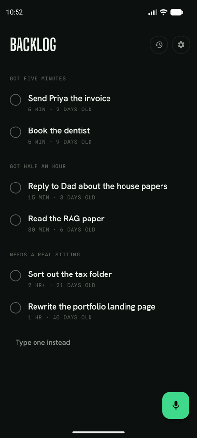
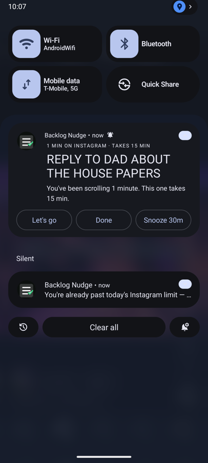
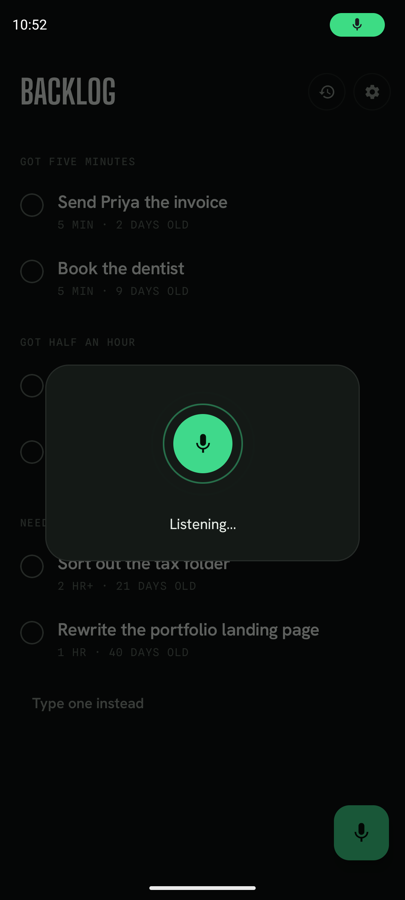
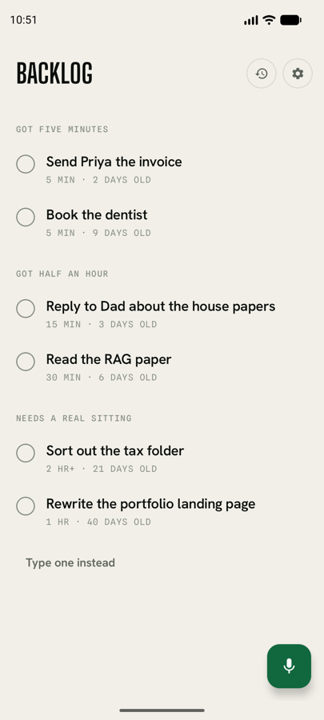
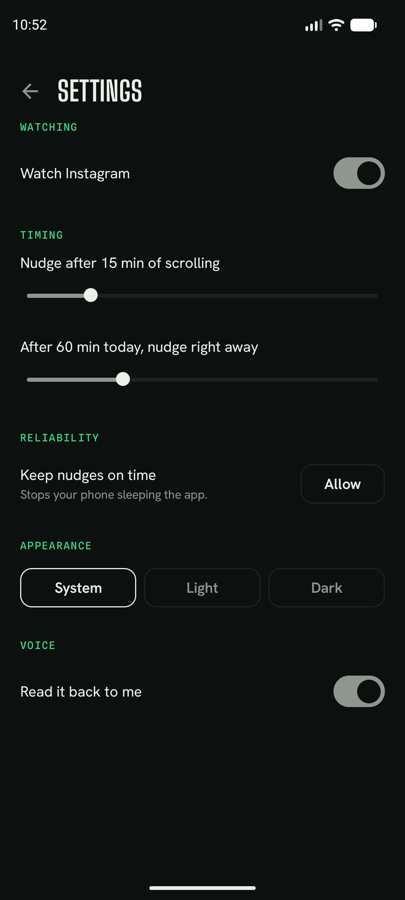
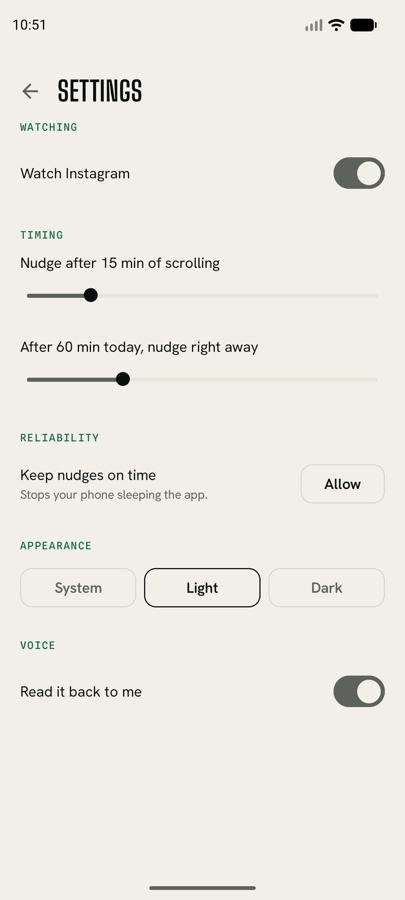

<h1 align="center">Backlog Nudge</h1>

<p align="center">
  <em>Every other screen-time app is a stop sign.<br>This one is a green light.</em>
</p>

<p align="center">
  
  
  
</p>

<p align="center">
  
  
  
</p>

---

## The idea

Things you meant to get to die in notes apps, because nothing reminds you of them *at the moment you actually have time* — which is usually the moment you opened Instagram instead.

Opal, Freedom and One Sec all answer that with a wall: block the app, lock it, make you breathe, make you wait. Backlog Nudge doesn't block anything. It waits until you've been scrolling a while, then offers **one** thing you already said you wanted to do, sized to the time you have:

> **Reply to Dad about the house papers**
> You've been scrolling 22 minutes. This one takes 15 min.

Tap **Let's go** and it drops you at your home screen. Instagram is still there — it just isn't in front of you any more.

## How it works

**1 · Say it.** Tap the mic, speak. Speech-to-text is Android's own, on-device. Your words become the item, as you said them.

**2 · It notices.** A foreground service polls `UsageStatsManager` for continuous time in a watched app. Brief interruptions — pulling down the notification shade — don't reset the timer.

**3 · It offers.** Past the threshold (default 15 minutes), one pending item surfaces as a notification, or a floating bubble on devices that support them. Once you're past your daily limit (default 60 minutes), re-opening the app nudges within 30 seconds instead of waiting all over again.

Nothing fires if your backlog is empty or everything is done — it says so rather than sitting silent.

## Screens

|  | Dark | Light |
|---|---|---|
| **The list** |  |  |
| **Settings** |  |  |

The list is grouped by **the time you have**, not by date — *Got five minutes* / *Got half an hour* / *Needs a real sitting*. Mid-scroll you never ask "what's oldest", you ask "what fits in this gap". Swipe a card right to finish it, left to snooze.

## Design notes

**Green is a budget, not a palette.** The app is ink, bone and three greys. Green is spent on exactly two things — **going** and **finishing**. Not headers, not icons, not warnings. It's the only saturated colour you ever see, which is why a nudge registers at all.

**Three typefaces, one job each.** Big Shoulders Display for headings, condensed and always uppercase. Hanken Grotesk for anything you read as a sentence. Spline Sans Mono for durations, because minutes are the unit this whole thing trades in.

**No jargon.** Nothing in the UI says "usage access", "watcher", "exempt", "foreground service" or "bubble". A permission screen says *"Notice the long scrolls"*, not a paragraph about how Android works.

## Privacy

The app makes **zero network calls** — the `INTERNET` permission isn't even declared. Nothing about what you use, or what's on your list, leaves the device.

Speech recognition runs through Android's on-device recogniser. Detection only ever asks the OS *which app is in front*, never what's on screen. Everything is stored in a local Room database.

## Build

```bash
git clone git@github.com:imrajeshkr/backlog-nudge.git
cd backlog-nudge
./gradlew assembleDebug
adb install -r app/build/outputs/apk/debug/app-debug.apk
```

First launch walks you through four permissions — usage access, battery exemption, microphone and notifications — each with one line explaining why.

Sideloaded builds hit Android's *Restricted settings* guard when granting usage access. If the toggle refuses: **Settings → Apps → Backlog Nudge → ⋮ → Allow restricted settings**, then try again.

## Status

Working: voice and typed capture, the time-bucketed list with swipe actions, usage detection with the daily-limit fast path, notification and bubble nudges with Done / Snooze / Let's go, light and dark themes with a System / Light / Dark override.

Not built: iOS, desktop, and any cross-device sync. There is no account and no backend.

## Licence

No licence yet — personal project.
